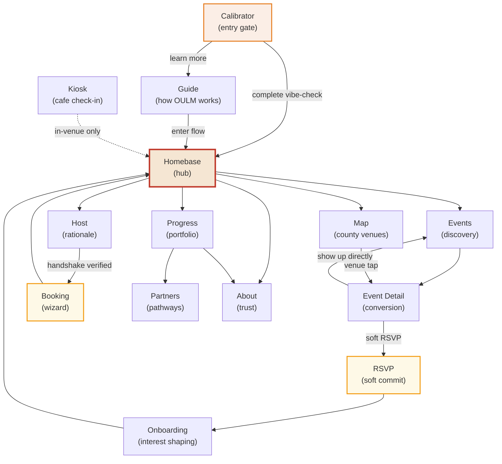
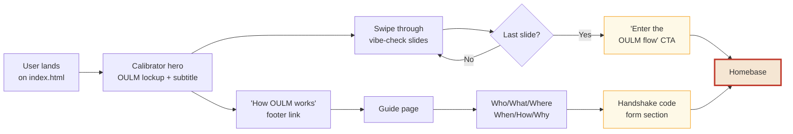
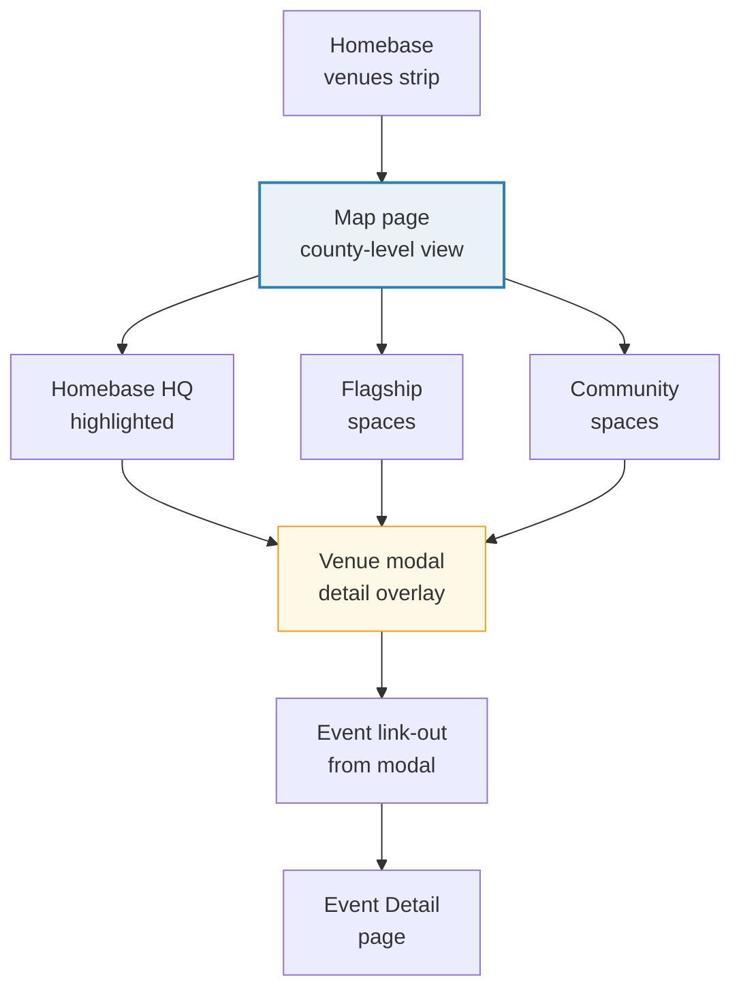
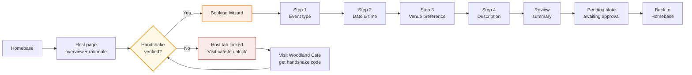
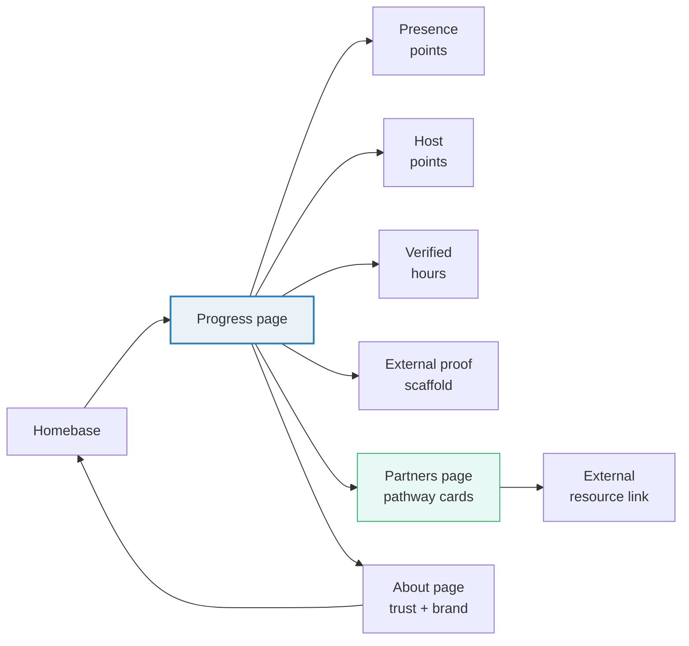
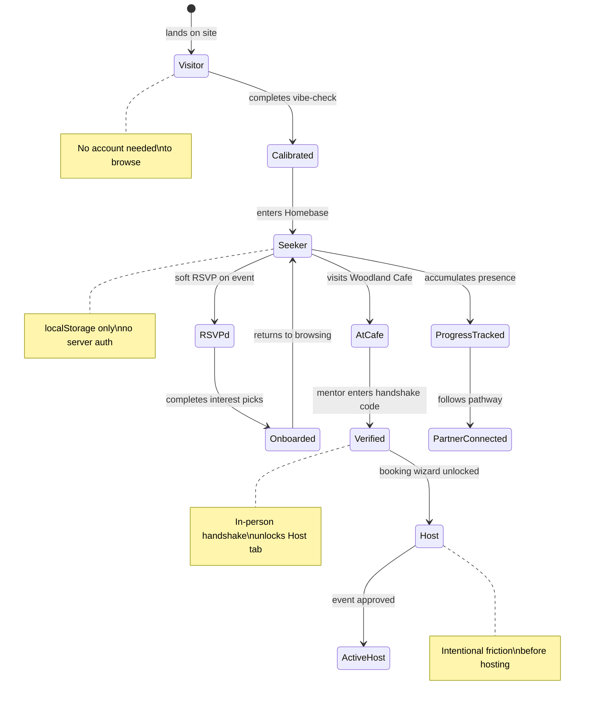

# OULM — User Flow & Screen Frame Diagrams

Paste any Mermaid block into [Excalidraw](https://excalidraw.com) via **Library > Mermaid to Excalidraw**, or render in any Mermaid-compatible viewer (GitHub, Notion, Obsidian, etc.).

---

## 1. Overall Navigation Sitemap

---

## 2. User Journey — Seeker to Host

```mermaid
flowchart LR
    subgraph GATE["Entry Gate"]
        direction LR
        A1["Land on\nCalibrator"] --> A2["Swipe vibe-check\nslides"]
        A2 --> A3["Enter OULM flow\nor read Guide"]
    end

    subgraph SEEK["Seeker Path"]
        direction LR
        B1["Browse\nHomebase"] --> B2["Discover\nevents"]
        B2 --> B3["View\nevent detail"]
        B3 --> B4["Soft RSVP\n(no account)"]
        B4 --> B5["Onboarding\ninterest shaping"]
        B5 --> B6["Suggested\ncircles"]
    end

    subgraph SHOW["Show Up"]
        direction LR
        C1["Arrive at\nWoodland Cafe"] --> C2["Mentor chat\n+ handshake code"]
        C2 --> C3["Host tab\nunlocks"]
    end

    subgraph HOST["Host Path"]
        direction LR
        D1["Explore\nhost rationale"] --> D2["Multi-step\nbooking wizard"]
        D2 --> D3["Review &\npending state"]
        D3 --> D4["Lead your\nown event"]
    end

    subgraph GROW["Growth"]
        direction LR
        E1["Track\npresence points"] --> E2["Accumulate\nhost points"]
        E2 --> E3["Verified hours\n+ external proof"]
        E3 --> E4["Partner\npathways"]
    end

    GATE --> SEEK
    SEEK --> SHOW
    SHOW --> HOST
    HOST --> GROW
```

---

## 3. Entry Gate Flow

---

## 4. Event Activation Flow

```mermaid
flowchart LR
    HOME["Homebase\nfeatured events"] --> EVT["Events page\nfilters + cards"]
    MAP["Map page\nvenue tap"] --> DET

    EVT --> DET["Event Detail\nfull info + social proof"]

    DET --> CTA_A["Soft RSVP\nCTA"]
    DET --> CTA_B["'Just show up'\nCTA"]

    CTA_A --> RSVP["RSVP page"]
    CTA_B --> EVT

    RSVP --> INTENT["Intent chips\n(attending / maybe / curious)"]
    INTENT --> GUESTS["Guest count\nchoices"]
    GUESTS --> NOTE["Optional\narrival note"]
    NOTE --> ACCOUNT["Soft account\nchoices"]
    ACCOUNT --> ONB["Onboarding"]

    ONB --> PICKS["Quick-pick\ninterest clouds"]
    PICKS --> CIRCLES["Suggested\ncircles output"]
    CIRCLES --> HOME2["Back to\nHomebase"]

    style DET fill:#fef9e7,stroke:#f39c12,stroke-width:2px
    style RSVP fill:#fef9e7,stroke:#f39c12,stroke-width:2px
    style ONB fill:#fbeee6,stroke:#e67e22
```

---

## 5. Map & Venue Discovery Flow

---

## 6. Host & Booking Flow

---

## 7. Progress & Pathways Flow

---

## 8. Access & Identity State Machine

---

## 9. Slide Deck — Screen-by-Screen Reference

| # | Screen | Role | Key Elements | Annotation |
|---|--------|------|-------------|------------|
| 1 | **Calibrator** | Entry gate | OULM lockup, vibe-check slides, dots, Enter CTA | Soft friction |
| 2 | **Guide** | Pre-gate transparency | Who/What/Where table, handshake code form | Trust cue |
| 3 | **Homebase** | Brand anchor & hub | Hero, pillar nav, featured events, venues, pathways | Locality cue |
| 4 | **Events** | Discovery | Filter pills, event cards, search | — |
| 5 | **Event Detail** | Conversion | Full info, social proof, FAQ, dual CTA | Trust cue |
| 6 | **RSVP** | Soft commitment | Intent chips, guest count, arrival note, soft account | Soft friction |
| 7 | **Onboarding** | Interest shaping | Quick-pick clouds, suggested circles | Post-RSVP identity |
| 8 | **Map** | Venue discovery | Leaflet county map, venue modals, event link-out | Locality cue |
| 9 | **Host** | Hosting rationale | Overview narrative, intentional friction, lock state | Soft friction |
| 10 | **Booking** | Multi-step wizard | 4-step stepper, review, pending state | Soft friction |
| 11 | **Progress** | Portfolio / proof | Presence points, host points, verified hours, external proof | Exportable state |
| 12 | **Partners** | Pathways & resources | Partner cards, external links, Three.js scene | — |
| 13 | **About** | Trust & brand | Brand rationale, YMCA framing | Trust cue |
| 14 | **Kiosk** | Cafe check-in (in-venue) | Minimal check-in UI | Locality cue |

---

## 10. Annotation Key

| Tag | Meaning |
|-----|---------|
| **Soft friction** | Intentional pacing — slows user down to build commitment, not frustration |
| **Trust cue** | Transparency element — shows who/what/why before asking for action |
| **Locality cue** | Anchors digital experience to physical place (Herts / Beds / Bucks) |
| **Post-RSVP identity** | Identity shaping that only happens after user shows commitment intent |
| **Exportable state** | localStorage data the user can download as JSON at any time |
